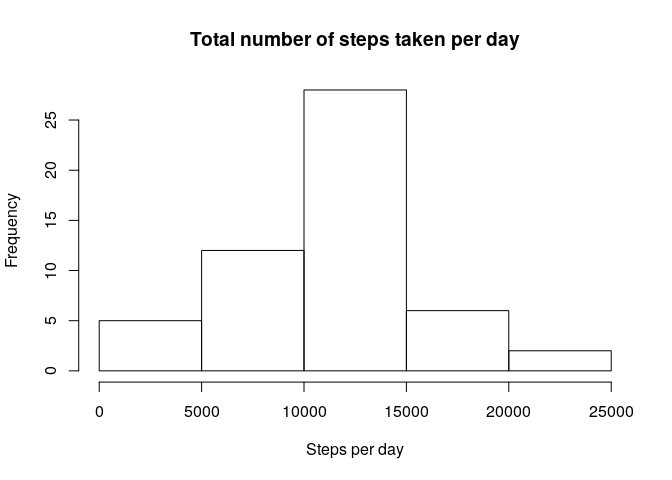
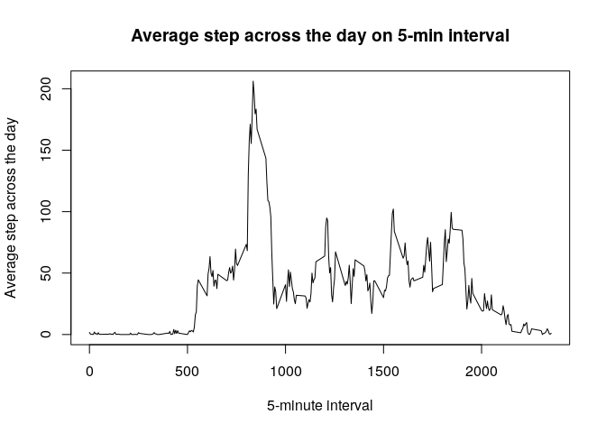
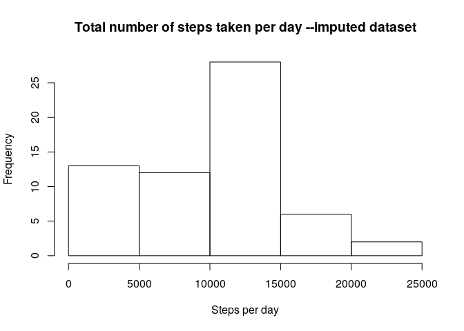
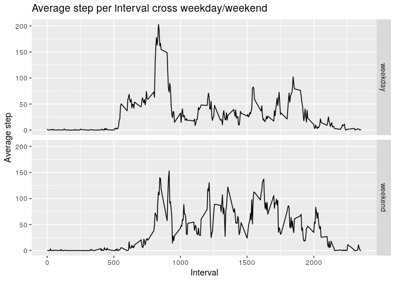
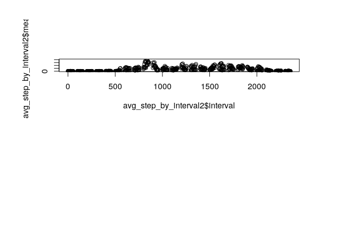

## Loading and preprocessing the data

```r
data <- read.csv(unz("activity.zip", "activity.csv"))
data$date <- as.Date(data$date)
str(data)
```

```
## 'data.frame':	17568 obs. of  3 variables:
##  $ steps   : int  NA NA NA NA NA NA NA NA NA NA ...
##  $ date    : Date, format: "2012-10-01" "2012-10-01" ...
##  $ interval: int  0 5 10 15 20 25 30 35 40 45 ...
```


## What is mean total number of steps taken per day?

```r
# calculate total number of steps taken per day
library(dplyr)
```

```
## 
## Attaching package: 'dplyr'
```

```
## The following objects are masked from 'package:stats':
## 
##     filter, lag
```

```
## The following objects are masked from 'package:base':
## 
##     intersect, setdiff, setequal, union
```

```r
data <- group_by(data, date)
step_per_day_summary <- summarise(data, step_per_day = sum(steps))

# plot histogram
hist(step_per_day_summary$step_per_day, 
     main = "Total number of steps taken per day",
     xlab = "Steps per day")
```

<!-- -->

```r
# calculate mean and median of total number of steps taken per day
mean <- mean(step_per_day_summary$step_per_day, na.rm = TRUE)
median <- median(step_per_day_summary$step_per_day, na.rm = TRUE)
print(paste("Mean : ", mean))
```

```
## [1] "Mean :  10766.1886792453"
```

```r
print(paste("Median : ", median))
```

```
## [1] "Median :  10765"
```


## What is the average daily activity pattern?

```r
avg_step_by_interval <- tapply(data$steps, data$interval, mean, 
                               na.rm = TRUE)
plot(row.names(avg_step_by_interval), avg_step_by_interval, type = "l",
     xlab = "5-minute interval", ylab = "Average step across the day",
     main = "Average step across the day on 5-min interval")
```

<!-- -->

```r
# interval with maximun number of steps
max_index <- which(avg_step_by_interval == max(avg_step_by_interval))
max_interval <- names(avg_step_by_interval[max_index])
print(paste("interval with maximum step is", max_interval))
```

```
## [1] "interval with maximum step is 835"
```


## Imputing missing values

```r
# find total number of NA
sum(is.na(data))
```

```
## [1] 2304
```

```r
# to fill in NA, use mean of the same day
mean_per_day <- tapply(data$steps, data$date, mean, na.rm = TRUE)
mean_per_day[is.nan(mean_per_day)] <- 0

# create new imputed dataset
imputed_data <- data
for(i in which(is.na(imputed_data$steps))){
  imputed_data$steps[i] <- mean_per_day[grep(imputed_data$date[i], names(mean_per_day))]
}

# plot histogram of new dataset
imputed_data <- group_by(imputed_data, date)
step_per_day_summary2 <- summarise(imputed_data, step_per_day = sum(steps))
hist(step_per_day_summary2$step_per_day, 
     main = "Total number of steps taken per day --imputed dataset",
     xlab = "Steps per day")
```

<!-- -->

```r
# calculate mean and median of total number of steps taken per day
mean2 <- mean(step_per_day_summary2$step_per_day)
median2 <- median(step_per_day_summary2$step_per_day)
print(paste("Mean : ", mean2))
```

```
## [1] "Mean :  9354.22950819672"
```

```r
print(paste("New mean differs from original mean =", mean2-mean))
```

```
## [1] "New mean differs from original mean = -1411.95917104856"
```

```r
print(paste("Median : ", median2))
```

```
## [1] "Median :  10395"
```

```r
print(paste("New median differs from original median =", median2-median))
```

```
## [1] "New median differs from original median = -370"
```


## Are there differences in activity patterns between weekdays and weekends?

```r
library(lubridate)
```

```
## 
## Attaching package: 'lubridate'
```

```
## The following objects are masked from 'package:dplyr':
## 
##     intersect, setdiff, union
```

```
## The following objects are masked from 'package:base':
## 
##     date, intersect, setdiff, union
```

```r
library(ggplot2)
# create a factor with 2 levels: weekday and weekend
imputed_data <- mutate(imputed_data, day = wday(date))
imputed_data$day[which(imputed_data$day %in% c(1, 7))] <- "weekend"
imputed_data$day[which(imputed_data$day %in% 2:6)] <- "weekday"
imputed_data <- transform(imputed_data, day = factor(day))

imputed_data <- group_by(imputed_data, day, interval)
avg_step_by_interval2 <- summarise(imputed_data, mean = mean(steps))

qplot(interval, mean, data = avg_step_by_interval2,
      facets = day~., geom = "line",
      xlab = "Interval", ylab = "Average step", 
      main = "Average step per interval cross weekday/weekend")
```

<!-- -->

```r
# panel plot with average steps taken by weekday/weekend
par(mfrow = c(2,1), oma = c(2,2,2,2))
plot(avg_step_by_interval2$interval, avg_step_by_interval2$mean)
```

<!-- -->
